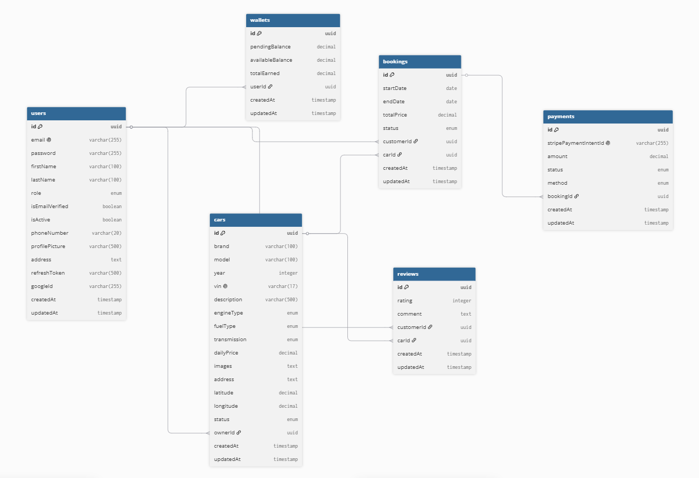

# AutoLease API

Car Rental & Marketplace Backend API built with Node.js, TypeScript, Express, and PostgreSQL.

---

## 🚢 Deployment

**Live API:** [https://autolease-api-n1tv.onrender.com](https://autolease-api-n1tv.onrender.com)

**Health Check:** [https://autolease-api-n1tv.onrender.com/health](https://autolease-api-n1tv.onrender.com/health)

Deployed on [Render](https://render.com) with PostgreSQL.

---

## Table of Contents
- [Tech Stack](#tech-stack)
- [Features](#features)
- [Project Structure](#project-structure)
- [Installation](#installation)
- [Environment Variables](#environment-variables)
- [Running the Application](#running-the-application)
- [API Documentation](#api-documentation)
- [API Endpoints](#api-endpoints)
- [Database Schema](#database-schema)
- [Deployment](#deployment)
- [Testing](#testing)
- [License](#license)

---

## Tech Stack

| Technology | Purpose |
|------------|---------|
| Node.js | Runtime environment |
| TypeScript | Type-safe JavaScript |
| Express.js | Web framework |
| PostgreSQL | Relational database |
| TypeORM | ORM for database operations |
| JWT | Authentication tokens |
| Google OAuth | Social login |
| Stripe | Payment processing |
| Cloudinary | Cloud image storage |
| Nodemailer | Email service |
| Swagger | API documentation |
| GitHub Actions | CI/CD pipeline |

---

## Features

### Authentication & Authorization
- Email/Password Registration & Login
- Google OAuth Login
- JWT Access & Refresh Tokens
- Email Verification
- Password Reset Flow
- Role-Based Access Control (Customer, Car Owner, Admin)

### Car Owner Module
- Register Vehicles with Multiple Images
- Edit & Delete Vehicles
- Set Daily Rental Price
- Manage Availability (Pause/Resume)
- View Bookings & Earnings

### Customer Module
- Browse Available Vehicles
- Search by Brand, Model, Description
- Filter by Price, Engine Type, Fuel Type, Transmission
- Sort by Price, Date
- Pagination on all list endpoints
- Book Vehicles (with overlap prevention)
- Cancel Bookings (with business rules)
- Leave Reviews & Ratings

### Booking System
- Booking Lifecycle: Pending → Awaiting Payment → Paid → Active → Completed / Cancelled
- Double Booking Prevention
- Date Validation

### Payment & Wallet
- Stripe Payment Integration
- Server-Side Payment Verification
- Wallet System (Pending & Available Balance)
- Commission Deduction (10%)

### Admin Module
- Platform Analytics Dashboard
- User Management (Suspend/Activate)
- Vehicle Management (Suspend/Activate)
- Owner Verification

### Security
- Helmet Security Headers
- CORS Protection
- Rate Limiting
- Request Validation (Zod)
- Password Hashing (bcrypt)
- JWT Authentication
- Webhook Signature Verification

### Wallet & Withdrawals
- Wallet with Pending & Available Balance
- Transaction History
- Withdrawal Requests with Bank Account
- Admin Approval/Rejection with Auto-Refund

### Webhooks
- Stripe Webhook Integration
- Payment Confirmation via Webhooks

### Testing
- 24 Unit & Integration Tests
- Auth module tests (JWT, passwords, emails, roles)
- Booking tests (overlap detection, status flow, pricing)
- Wallet tests (balance management, commission)
- API tests (response format, status codes, pagination)

---

## Project Structure

```text
autolease-api
├──  src/
|    ├── config/              # Configuration (database, env, Stripe, Cloudinary, email, Swagger)
|    ├── controllers/         # API request handlers
|    ├── database/
|    │   ├── migrations/      # Database migrations
|    │   └── seeders/         # Database seeders
|    ├── entities/            # TypeORM entities
|    ├── interfaces/          # TypeScript interfaces
|    ├── middlewares/         # Authentication, validation and upload middleware
|    ├── repositories/        # Database access layer
|    ├── routes/              # API route definitions
|    ├── services/            # Business logic
|    ├── subscribers/         # TypeORM subscribers
|    ├── types/               # Shared type definitions
|    ├── utils/               # Utility functions
|    ├── validators/          # Zod validation schemas
|    └── index.ts             # Application entry point
├── README.md
└── tsconfig.json
```

---

## Installation

```bash
# Clone the repository
git clone https://github.com/iibrahimx/autolease-api.git
cd autolease-api

# Install dependencies
npm install

# Create .env file from example
cp .env.example .env

# Run database migrations
npm run migration:run

# Start development server
npm run dev
```

---

## Environment Variables
Copy `.env.example` to `.env` and fill in your values:

```env
# Application
NODE_ENV=development
PORT=3001
APP_NAME=AutoLease
APP_URL=http://localhost:3001
FRONTEND_URL=http://localhost:5173

# Database
DB_HOST=localhost
DB_PORT=5432
DB_USERNAME=postgres
DB_PASSWORD=your_password
DB_NAME=autolease

# JWT
JWT_ACCESS_SECRET=your_access_secret
JWT_REFRESH_SECRET=your_refresh_secret
JWT_ACCESS_EXPIRATION=900
JWT_REFRESH_EXPIRATION=604800

# Google OAuth
GOOGLE_CLIENT_ID=your_google_client_id
GOOGLE_CLIENT_SECRET=your_google_client_secret
GOOGLE_CALLBACK_URL=http://localhost:3001/api/auth/google/callback

# Cloudinary
CLOUDINARY_CLOUD_NAME=your_cloud_name
CLOUDINARY_API_KEY=your_api_key
CLOUDINARY_API_SECRET=your_api_secret

# Stripe
STRIPE_SECRET_KEY=sk_test_your_key
STRIPE_PUBLISHABLE_KEY=pk_test_your_key
STRIPE_WEBHOOK_SECRET=whsec_your_secret

# Email (SMTP)
SMTP_HOST=smtp.gmail.com
SMTP_PORT=587
SMTP_USER=your_email@gmail.com
SMTP_PASS=your_app_password
```

---

## Running the Application

```bash
# Development
npm run dev

# Type check
npm run typecheck

# Build for production
npm run build

# Start production server
npm start
```

### Testing

```bash
# Run tests
npm test

# Run tests with coverage
npm run test:coverage
```

---

## Test Credentials

Run seeders to create test accounts:

```bash
npm run seed:run
```

| Role | Email | Password |
|------|-------|----------|
| Admin | admin@autolease.com | admin123 |
| Car Owner | testowner@autolease.com | owner123 |
| Customer | testcustomer@autolease.com | customer123 |

---

## API Documentation

Interactive Swagger documentation available at:

**Swagger Docs:** [https://autolease-api-n1tv.onrender.com/api/docs](https://autolease-api-n1tv.onrender.com/api/docs)

**Postman Collection:** Available in `postman_collection.json`

---

## API Endpoints

### Authentication

| Method | Endpoint | Description |
|--------|----------|-------------|
| POST | `/api/auth/register` | Register a new user |
| POST | `/api/auth/login` | Login with email and password |
| POST | `/api/auth/google` | Login with Google |
| POST | `/api/auth/change-password` | Change password |
| POST | `/api/auth/forgot-password` | Request password reset |
| POST | `/api/auth/reset-password` | Reset password |

### Users

| Method | Endpoint | Description |
|--------|----------|-------------|
| GET | `/api/users/profile` | Get user profile |
| PUT | `/api/users/profile` | Update user profile |

### Cars

| Method | Endpoint | Description |
|--------|----------|-------------|
| GET | `/api/cars/browse` | Browse, search and filter cars |
| GET | `/api/cars/:id` | Get car details |
| POST | `/api/cars` | Register a new car |
| GET | `/api/cars/my-cars` | Get owner's cars |
| PUT | `/api/cars/:id` | Update car |
| DELETE | `/api/cars/:id` | Delete car |
| PATCH | `/api/cars/:id/availability` | Toggle car availability |
| POST | `/api/cars/upload-images` | Upload car images |

### Bookings

| Method | Endpoint | Description |
|--------|----------|-------------|
| POST | `/api/bookings` | Create booking |
| PUT | `/api/bookings/:id/cancel` | Cancel booking |

### Reviews

| Method | Endpoint | Description |
|--------|----------|-------------|
| GET | `/api/reviews/car/:carId` | Get reviews for a car |
| POST | `/api/reviews` | Create review |
| PUT | `/api/reviews/:id` | Update review |
| DELETE | `/api/reviews/:id` | Delete review |

### Payments

| Method | Endpoint | Description |
|--------|----------|-------------|
| POST | `/api/payments/create` | Create payment intent |

### Wallet
| Method | Endpoint | Description |
|--------|----------|-------------|
| GET | `/api/wallet` | Get wallet details & transactions |

### Withdrawals
| Method | Endpoint | Description |
|--------|----------|-------------|
| POST | `/api/withdrawals` | Request withdrawal |
| GET | `/api/withdrawals` | View withdrawal history |

### Admin

| Method | Endpoint | Description |
|--------|----------|-------------|
| GET | `/api/admin/dashboard` | Get dashboard statistics |
| PATCH | `/api/admin/users/:userId/suspend` | Suspend user |
| PATCH | `/api/admin/users/:userId/activate` | Activate user |
| PATCH | `/api/admin/users/:userId/verify` | Verify vehicle owner |
| PATCH | `/api/admin/vehicles/:carId/suspend` | Suspend vehicle |
| PATCH | `/api/admin/vehicles/:carId/activate` | Activate vehicle |
| GET | `/api/admin/withdrawals` | View all withdrawals |
| PATCH | `/api/admin/withdrawals/:id/approve` | Approve withdrawal |
| PATCH | `/api/admin/withdrawals/:id/reject` | Reject withdrawal |

---
## Database Schema



